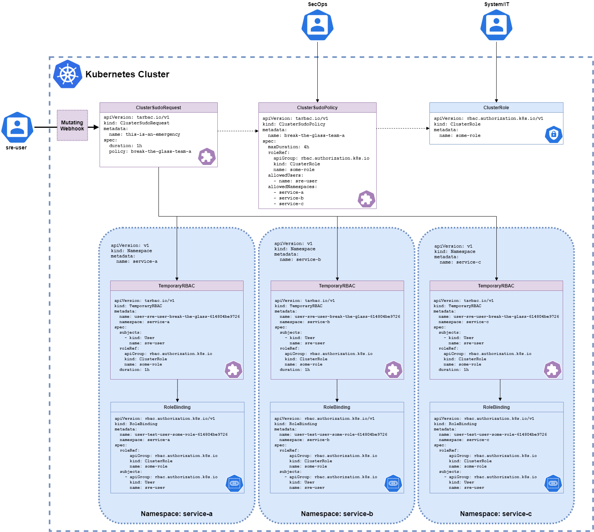
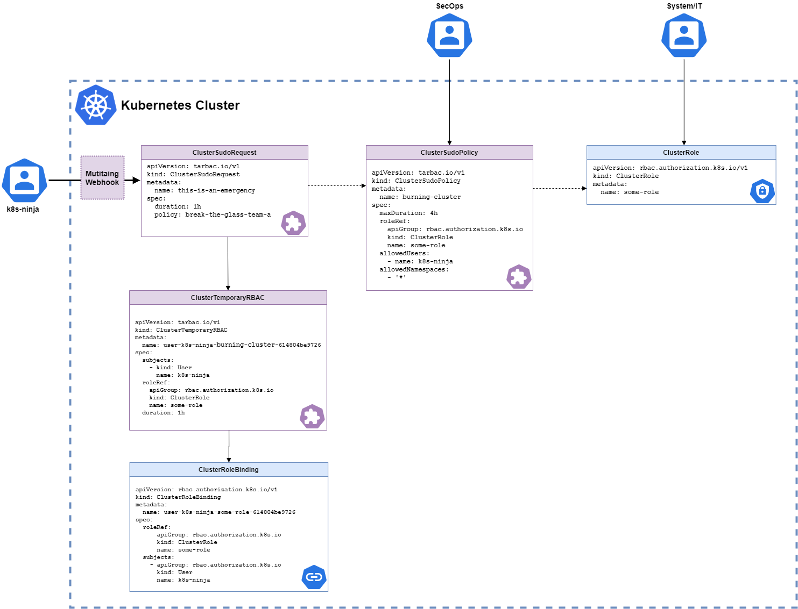
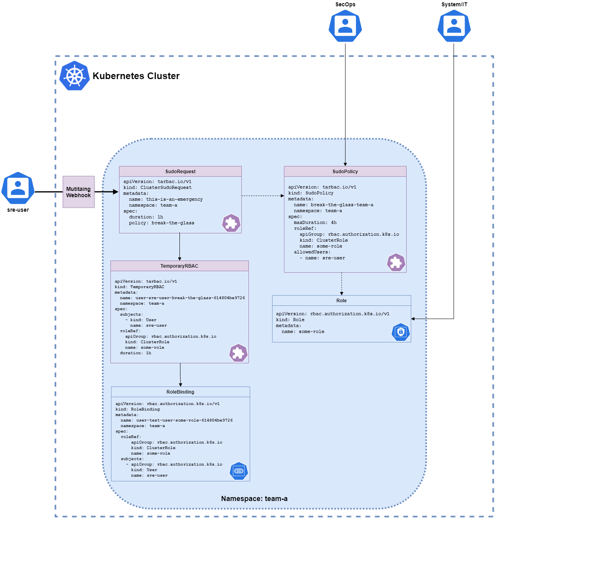
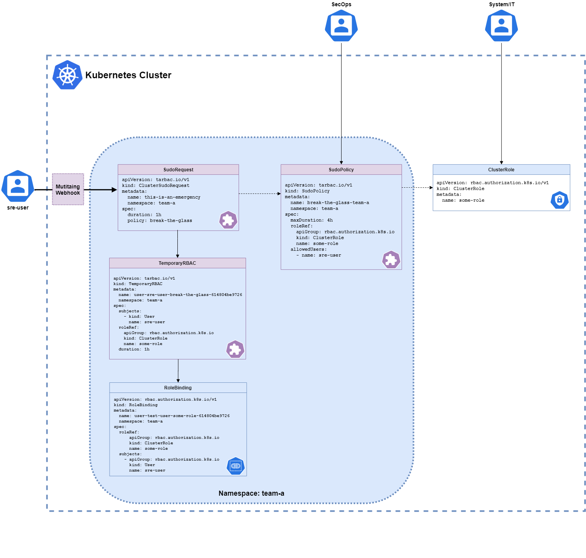

# TARBAC High-Level Design

## Table of Contents

- [TARBAC High-Level Design](#tarbac-high-level-design)
  - [Table of Contents](#table-of-contents)
  - [1. Overview](#1-overview)
  - [2. Architecture](#2-architecture)
    - [2.1 Custom Resource Definitions (CRDs)](#21-custom-resource-definitions-crds)
    - [2.2 Controllers](#22-controllers)
    - [2.3 Webhook](#23-webhook)
    - [2.4 Key Features](#24-key-features)
    - [Diagram: System Architecture](#diagram-system-architecture)
      - [Cluster Scoped Permissions](#cluster-scoped-permissions)
        - [1. Allowed Namespaces](#1-allowed-namespaces)
        - [2. Allowed Namespaces Selector](#2-allowed-namespaces-selector)
        - [3. Cluster Permissions](#3-cluster-permissions)
      - [Namespace Scoped Permissions](#namespace-scoped-permissions)
        - [1. Binding to a Role](#1-binding-to-a-role)
        - [2. Binding to a ClusterRole](#2-binding-to-a-clusterrole)
  - [3. Operations](#3-operations)
    - [3.1 Workflow](#31-workflow)
  - [4. Lifecycle Management](#4-lifecycle-management)
    - [4.1 Policy Lifecycle](#41-policy-lifecycle)
    - [4.2 Request Lifecycle](#42-request-lifecycle)
    - [4.3 Temporary RBAC Lifecycle](#43-temporary-rbac-lifecycle)
  - [5. Components](#5-components)
    - [5.1 CRD Details](#51-crd-details)
      - [`ClusterSudoPolicy`](#clustersudopolicy)
      - [`SudoPolicy`](#sudopolicy)
      - [`ClusterSudoRequest`](#clustersudorequest)
      - [`SudoRequest`](#sudorequest)
      - [`ClusterTemporaryRBAC`](#clustertemporaryrbac)
      - [`TemporaryRBAC`](#temporaryrbac)
    - [5.2 Controllers](#52-controllers)
      - [ClusterSudoPolicyReconciler](#clustersudopolicyreconciler)
      - [SudoPolicyReconciler](#sudopolicyreconciler)
      - [ClusterSudoRequestReconciler](#clustersudorequestreconciler)
      - [SudoRequestReconciler](#sudorequestreconciler)
      - [ClusterTemporaryRBACReconciler](#clustertemporaryrbacreconciler)
      - [TemporaryRBACReconciler](#temporaryrbacreconciler)
    - [5.3 Webhook](#53-webhook)
      - [SudoRequestAnnotator](#sudorequestannotator)

## 1. Overview

The **Time and Role-Based Access Controller (TARBAC)** provides a Kubernetes-native solution to manage temporary RBAC permissions dynamically. It ensures secure, time-limited access by leveraging a self-service, policy-driven approach. Developers request what they need, policies validate the request, and temporary access is granted (and revoked) automatically.

## 2. Architecture

### 2.1 Custom Resource Definitions (CRDs)

TARBAC defines six CRDs:

- **`ClusterSudoPolicy`:** Cluster-wide policy defining allowed users, namespaces, and maximum duration for temporary RBAC access.
- **`ClusterSudoRequest`:** Request to invoke a ClusterSudoPolicy for temporary permissions.
- **`ClusterTemporaryRBAC`:** Cluster-scoped temporary RBAC bindings.
- **`SudoPolicy`:** Namespaced policy defining allowed users and maximum duration for RBAC access.
- **`SudoRequest`:** Request to invoke a SudoPolicy for namespaced RBAC bindings.
- **`TemporaryRBAC`:** Namespaced RBAC bindings for temporary access.

### 2.2 Controllers

Each CRD has a dedicated controller to reconcile its state:

- **ClusterSudoPolicyReconciler:** Validates policies, ensures mutual exclusivity of selectors, and dynamically resolves namespaces.
- **ClusterSudoRequestReconciler:** Processes requests, validates durations, and creates namespaced or cluster-scoped TemporaryRBACs.
- **ClusterTemporaryRBACReconciler:** Manages cluster-wide bindings and cleans up expired resources.
- **SudoPolicyReconciler:** Validates policies for namespaced RBAC.
- **SudoRequestReconciler:** Processes namespaced requests and creates TemporaryRBACs.
- **TemporaryRBACReconciler:** Manages namespaced bindings and ensures cleanup upon expiration.

### 2.3 Webhook

The **SudoRequestAnnotator** webhook enriches `SudoRequest` and `ClusterSudoRequest` resources with metadata, such as the requesting user's identity and group information.

### 2.4 Key Features

- **Time-Limited Access:** Enforces expiration of RBAC permissions.
- **Dynamic Namespace Selection:** Policies can use label selectors for namespaces.
- **Granular RBAC Management:** Supports cluster-scoped and namespaced RBAC policies.
- **Retention Policies:** Determines whether expired resources are deleted or retained.

### Diagram: System Architecture

#### Cluster Scoped Permissions

##### 1. Allowed Namespaces

##### 2. Allowed Namespaces Selector

##### 3. Cluster Permissions

#### Namespace Scoped Permissions

##### 1. Binding to a Role

##### 2. Binding to a ClusterRole

## 3. Operations

### 3.1 Workflow

1. **Policy Definition:** Admins define `ClusterSudoPolicy` or `SudoPolicy` with rules for temporary access.
2. **Request Submission:** Users submit `ClusterSudoRequest` or `SudoRequest` specifying the policy and duration.
3. **Validation:** Controllers validate the request against the policy, ensuring user eligibility, namespace access, and duration limits.
4. **Temporary RBAC Creation:** Controllers generate temporary RoleBindings or ClusterRoleBindings.
5. **Expiration Management:** Controllers monitor expiration and clean up expired resources.

## 4. Lifecycle Management

### 4.1 Policy Lifecycle

1. **Creation:** Admin defines `ClusterSudoPolicy` or `SudoPolicy`.
2. **Validation:** Policy reconciler validates configurations and resolves namespaces.
3. **Update:** Dynamic namespace selectors trigger periodic reconciliation.
4. **Deletion:** Policy removal cascades to dependent resources.

### 4.2 Request Lifecycle

1. **Submission:** User submits `SudoRequest` or `ClusterSudoRequest`.
2. **Validation:** Request reconciler checks policy compliance.
3. **Approval:** TemporaryRBAC resources are created.
4. **Expiration:** Expired RBAC bindings are cleaned up.

### 4.3 Temporary RBAC Lifecycle

1. **Creation:** Generated by request controllers.
2. **Validation:** Ensures correct RoleBinding or ClusterRoleBinding.
3. **Expiration:** Automatically cleaned up by TemporaryRBAC reconciler.

## 5. Components

### 5.1 CRD Details

#### `ClusterSudoPolicy`

- **Purpose:** Define cluster-scoped RBAC rules.
- **Key Fields:**
  - `maxDuration`: Maximum allowed duration (e.g., `4h`).
  - `allowedNamespacesSelector`: Dynamic namespace selection.
  - `allowedUsers`: List of eligible users.

#### `SudoPolicy`

- **Purpose:** Define namespaced RBAC rules.
- **Key Fields:**
  - `maxDuration`: Maximum allowed duration.
  - `allowedUsers`: List of eligible users.

#### `ClusterSudoRequest`

- **Purpose:** Define cluster-scoped request for elevated permissions.
- **Key Fields:**
  - `duration`: duration requested for elevated permissions (e.g., `4h`).
  - `policy`: the `ClusterSudoPolicy` resource to refer to.

#### `SudoRequest`

- **Purpose:** Define namespace-scoped request for elevated permissions.
- **Key Fields:**
  - `duration`: duration requested for elevated permissions (e.g., `4h`).
  - `policy`: the `SudoPolicy` resource to refer to.

#### `ClusterTemporaryRBAC`

- **Purpose:** Create temporary `RoleBinding` or `ClusterRoleBinding`.
- **Key Fields:**
  - `duration`: Time-bound validity.
  - `roleRef`: ClusterRole reference.
  - `subjects`: Users or groups granted access.

#### `TemporaryRBAC`

- **Purpose:** Create temporary `RoleBinding`.
- **Key Fields:**
  - `duration`: Time-bound validity.
  - `roleRef`: Role or ClusterRole reference.
  - `subjects`: Users or groups granted access.

### 5.2 Controllers

#### ClusterSudoPolicyReconciler

- Validates mutual exclusivity of namespace selectors.
- Resolves namespaces dynamically.
- Validates referenced role exists.

#### SudoPolicyReconciler

- Validates referenced role exists.

#### ClusterSudoRequestReconciler

- Validates request against policy.
- Creates ClusterTemporaryRBAC or TemporaryRBAC.

#### SudoRequestReconciler

- Validates request against policy.
- Creates TemporaryRBAC.

#### ClusterTemporaryRBACReconciler

- Manages lifecycle of cluster-scoped bindings.
- Cleans up expired bindings.

#### TemporaryRBACReconciler

- Creates RoleBindings/ClusterRoleBindings.
- Ensures cleanup upon expiration.

### 5.3 Webhook

#### SudoRequestAnnotator

- Adds requester identity and group metadata to requests.
- Ensures consistency in annotations.
