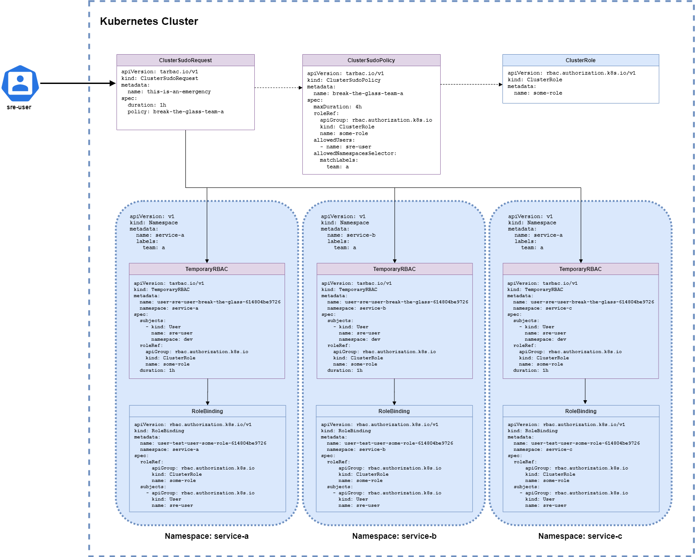

# TARBAC High-Level Design Document

## 1. Overview

The **Time and Role-Based Access Controller (TARBAC)** provides a Kubernetes-native solution to manage temporary RBAC permissions dynamically.
It ensures secure, time-limited access by leveraging a self-service, policy-driven approach.
Developers request what they need, policies validate the request, and temporary access is granted (and revoked) automatically.

This document outlines TARBAC's architecture, operations, lifecycle, and components, offering insight into its design and implementation.

## 2. Architecture

TARBAC comprises the following key components:

### 2.1 Custom Resource Definitions (CRDs)

TARBAC defines six CRDs:

- **ClusterSudoPolicy:** Cluster-wide policy defining allowed users, namespaces, and maximum duration for temporary RBAC access.
- **ClusterSudoRequest:** Request to invoke a ClusterSudoPolicy for temporary permissions.
- **ClusterTemporaryRBAC:** Cluster-scoped temporary RBAC bindings.
- **SudoPolicy:** Namespaced policy defining allowed users and maximum duration for RBAC access.
- **SudoRequest:** Request to invoke a SudoPolicy for namespaced RBAC bindings.
- **TemporaryRBAC:** Namespaced RBAC bindings for temporary access.

### 2.2 Controllers

Each CRD has a dedicated controller to reconcile its state:

- **ClusterSudoPolicyReconciler:** Validates policies, ensures mutual exclusivity of selectors, and dynamically resolves namespaces.
- **ClusterSudoRequestReconciler:** Processes requests, validates durations, and creates namespaced or cluster-scoped TemporaryRBACs.
- **ClusterTemporaryRBACReconciler:** Manages cluster-wide bindings and cleans up expired resources.
- **SudoPolicyReconciler:** Validates policies for namespaced RBAC.
- **SudoRequestReconciler:** Processes namespaced requests and creates TemporaryRBACs.
- **TemporaryRBACReconciler:** Manages namespaced bindings and ensures cleanup upon expiration.

### 2.3 Webhook

The **SudoRequestAnnotator** webhook enriches `SudoRequest` and `ClusterSudoRequest` resources with metadata, such as the requesting user's identity and group information.

### 2.4 Key Features

- **Time-Limited Access:** Enforces expiration of RBAC permissions.
- **Dynamic Namespace Selection:** Policies can use label selectors for namespaces.
- **Granular RBAC Management:** Supports cluster-scoped and namespaced RBAC policies.
- **Retention Policies:** Determines whether expired resources are deleted or retained.

### Diagram: System Architecture



---

## 3. Operations

### 3.1 Workflow

1. **Policy Definition:** Admins define `ClusterSudoPolicy` or `SudoPolicy` with rules for temporary access.
2. **Request Submission:** Users submit `ClusterSudoRequest` or `SudoRequest` specifying the policy and duration.
3. **Validation:** Controllers validate the request against the policy, ensuring user eligibility, namespace access, and duration limits.
4. **Temporary RBAC Creation:** Controllers generate temporary RoleBindings or ClusterRoleBindings.
5. **Expiration Management:** Controllers monitor expiration and clean up expired resources.

### Diagram: Request Workflow

```plaintext
User -> [Webhook] -> Request CR -> [Controller] -> TemporaryRBAC
                                                -> Cleanup Expired
```

---

## 4. Lifecycle Management

### 4.1 Policy Lifecycle

1. **Creation:** Admin defines `ClusterSudoPolicy` or `SudoPolicy`.
2. **Validation:** Policy reconciler validates configurations and resolves namespaces.
3. **Update:** Dynamic namespace selectors trigger periodic reconciliation.
4. **Deletion:** Policy removal cascades to dependent resources.

### 4.2 Request Lifecycle

1. **Submission:** User submits `SudoRequest` or `ClusterSudoRequest`.
2. **Validation:** Request reconciler checks policy compliance.
3. **Approval:** TemporaryRBAC resources are created.
4. **Expiration:** Expired RBAC bindings are cleaned up.

### 4.3 Temporary RBAC Lifecycle

1. **Creation:** Generated by request controllers.
2. **Validation:** Ensures correct RoleBinding or ClusterRoleBinding.
3. **Expiration:** Automatically cleaned up by TemporaryRBAC reconciler.

---

## 5. Components

### 5.1 CRD Details

#### ClusterSudoPolicy

- **Purpose:** Define cluster-scoped RBAC rules.
- **Key Fields:**
  - `maxDuration`: Maximum allowed duration (e.g., `4h`).
  - `allowedNamespacesSelector`: Dynamic namespace selection.
  - `allowedUsers`: List of eligible users.

#### SudoPolicy

- **Purpose:** Define namespaced RBAC rules.
- **Key Fields:**
  - `maxDuration`: Maximum allowed duration.
  - `allowedUsers`: List of eligible users.

#### TemporaryRBAC

- **Purpose:** Create temporary RoleBinding or ClusterRoleBinding.
- **Key Fields:**
  - `duration`: Time-bound validity.
  - `roleRef`: Role or ClusterRole reference.
  - `subjects`: Users or groups granted access.

### 5.2 Controllers

#### ClusterSudoPolicyReconciler

- Validates mutual exclusivity of namespace selectors.
- Resolves namespaces dynamically.

#### ClusterSudoRequestReconciler

- Validates request against policy.
- Creates ClusterTemporaryRBAC.

#### ClusterTemporaryRBACReconciler

- Manages lifecycle of cluster-scoped bindings.
- Cleans up expired bindings.

#### TemporaryRBACReconciler

- Creates RoleBindings/ClusterRoleBindings.
- Ensures cleanup upon expiration.

### 5.3 Webhook

#### SudoRequestAnnotator

- Adds requester identity and group metadata to requests.
- Ensures consistency in annotations.

---

## 6. Interactions

### Example Interaction: ClusterSudoRequest

1. User submits a `ClusterSudoRequest` with `policy=team-a-policy` and `duration=2h`.
2. Webhook annotates the request with user identity.
3. Controller:
   - Validates the request.
   - Creates `ClusterTemporaryRBAC`.
   - Adds a ClusterRoleBinding.
4. On expiration, the controller deletes the ClusterRoleBinding.

### Diagram: Interaction Flow

```plaintext
[User] -> [ClusterSudoRequest] -> [Webhook] -> [Controller] -> [ClusterTemporaryRBAC]
                                               ^                  |
                                               |                  v
                                               |          Cleanup Expired
                                               +--------------------------+
```

---

## 7. Conclusion

TARBAC provides a robust framework for managing temporary RBAC permissions in Kubernetes. Its modular design, leveraging CRDs, controllers, and webhooks, ensures secure and flexible access control. By automating the lifecycle of temporary permissions, TARBAC minimizes manual intervention and reduces security risks.

